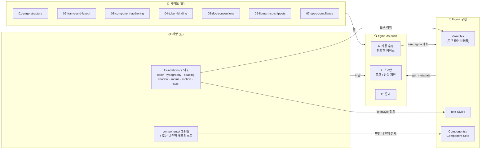
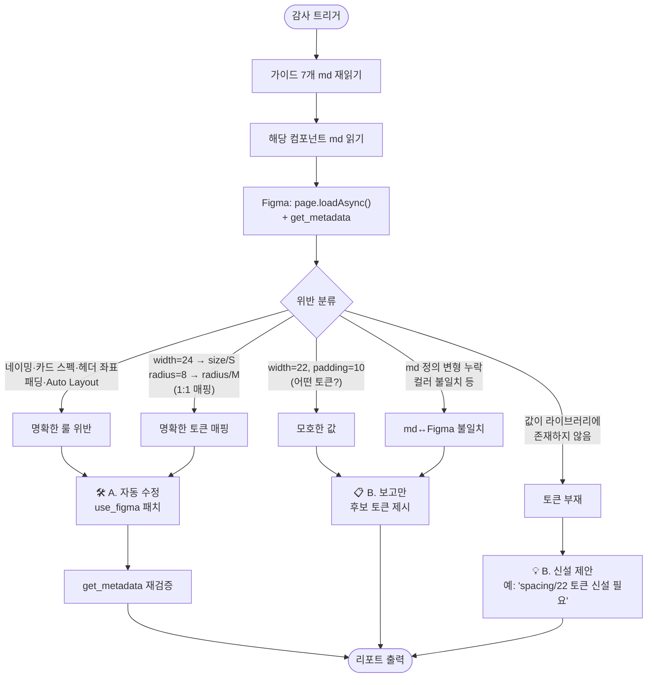

# Figma Design System Guide

Vetching 디자인 시스템을 Figma에서 작성·유지보수하기 위한 규칙 모음.

**문서 의도**: 페이지 구분, 정렬, 배치 등을 사람이 보기 좋게 정돈하는 것을 핵심으로 하되, 이를 뒷받침하는 컴포넌트 작성·토큰 바인딩·문서 작성 메타 규칙도 함께 정리한다.

---

## 전체 동작 한눈에 보기

본 디자인 시스템은 **사양(md) ↔ 구현(Figma) ↔ 검증(audit skill)** 세 축으로 구성된다.

### 1. 전체 시스템 구성

**계층 의미**:
- **가이드** = "어떻게 작성할 것인가" (룰)
- **사양** = "무엇을 작성할 것인가" (값·구조)
- **Figma** = "실제로 작성된 것" (구현)
- **Audit** = "사양대로 작성됐는가" (검증 루프)

### 2. figma-ds-audit 동작 흐름

---

## How to use

### 시나리오 1 — 새 컴포넌트 작성

1. `components/{NN}-{name}.md` 사양서를 먼저 작성한다 (변형·토큰 매핑·상태·사이즈).
2. 필요한 토큰이 라이브러리에 모두 있는지 확인한다. 없으면 [`04-token-binding.md#토큰-부재-시-신설-의무`](04-token-binding.md#토큰-부재-시-신설-의무)에 따라 토큰부터 신설한다.
3. Figma에 컴포넌트를 작성하고 토큰을 바인딩한다. 페이지 구조는 [`01-page-structure.md`](01-page-structure.md), 카드/좌표는 [`02-frame-and-layout.md`](02-frame-and-layout.md) 따른다.
4. 작성 후 `/figma-ds-audit`로 감사한다.
5. [`CHANGELOG.md`](CHANGELOG.md)와 Figma `Change Log` 페이지에 entry를 추가한다.

### 시나리오 2 — 기존 컴포넌트 수정

1. md를 먼저 수정한 후 Figma를 수정한다 (md = 사양서).
2. 토큰 바인딩이 누락되지 않았는지 [`04-token-binding.md#토큰-바인딩-검증-의무`](04-token-binding.md#토큰-바인딩-검증-의무)에 따라 확인한다.
3. `/figma-ds-audit`로 정합성 검증.
4. CHANGELOG 동기화.

### 시나리오 3 — 정기 감사

- 월 1회 권장: `/figma-ds-audit components` — 38개 컴포넌트 전수 검사.
- audit 결과는 자동 수정됨 / 수동 확인 필요 / 통과 3가지 카테고리로 분류된다.

### Audit 호출 방법

| 호출 | 범위 |
|---|---|
| `/figma-ds-audit` | 현재 선택된 노드 |
| `/figma-ds-audit all` | 현재 열린 페이지 전체 |
| `/figma-ds-audit components` | 전체 38개 컴포넌트 페이지 |

---

## 파일 구성

| 파일 | 다루는 내용 |
|---|---|
| [01-page-structure.md](01-page-structure.md) | 페이지 네이밍, 전체 페이지 구조, Cover · Change Log 페이지 양식, 페이지 내 메타 박스 금지 정책 |
| [02-frame-and-layout.md](02-frame-and-layout.md) | 흰색 카드 프레임 스펙, 페이지 내 배치 간격, 변형 그리드 배치 규칙 (계층 기반 배치, 페이지 레이아웃 좌표, 패딩 검증) |
| [03-component-authoring.md](03-component-authoring.md) | 컴포넌트 Sizing (HUG/FILL/FIXED), Variants 구성 (Component Set), Variants 네이밍, T-Shirt 사이즈 표기 |
| [04-token-binding.md](04-token-binding.md) | Size · Spacing · Radius · Color 토큰 바인딩 원칙, 타이포그래피 Text Style 적용 규칙, **토큰 바인딩 검증 의무**, **토큰 부재 시 신설 의무** |
| [05-doc-conventions.md](05-doc-conventions.md) | md 문서 국문 작성 규칙, 아이콘 사용 공통 규칙 (기호 텍스트 금지) |
| [06-figma-mcp-snippets.md](06-figma-mcp-snippets.md) | Figma MCP(`use_figma`)로 일괄 적용하는 자동화 스크립트 모음 |
| [07-spec-compliance.md](07-spec-compliance.md) | 컴포넌트 md ↔ Figma 정합성 검증 규칙 (변형 목록, 사이즈 매핑, 컬러, 상태, 아이콘 인스턴스) |
| [CHANGELOG.md](CHANGELOG.md) | 버전 이력 + SemVer 기반 버전 부여 정책 + Figma `Change Log` 페이지 동기화 정책 |

## 문서 수정 시 유의사항

- 가이드 문서를 수정하면 [CHANGELOG.md](CHANGELOG.md)에 항목을 추가하고, 같은 내용을 Figma `Change Log` 페이지에도 동기화한다.
- 페이지·카드 프레임에는 정책·노트·버전 콜아웃 등 메타 텍스트를 두지 않는다. ([01-page-structure.md#페이지-내-메타-박스-금지](01-page-structure.md#페이지-내-메타-박스-금지))
- 가이드 외에 단일 컴포넌트별 세부 사양은 [`../components/{NN}-{name}.md`](../components/) 파일을, 파운데이션 토큰 정의는 [`../foundations/`](../foundations/) 파일을 참조한다.
- 토큰 신설이 필요한 경우 [04-token-binding.md#토큰-부재-시-신설-의무](04-token-binding.md#토큰-부재-시-신설-의무) 절차를 따른다.
